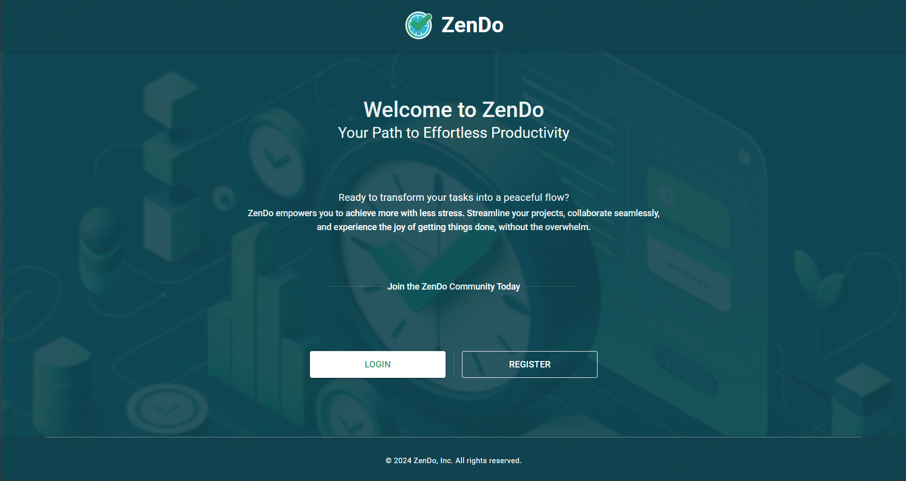
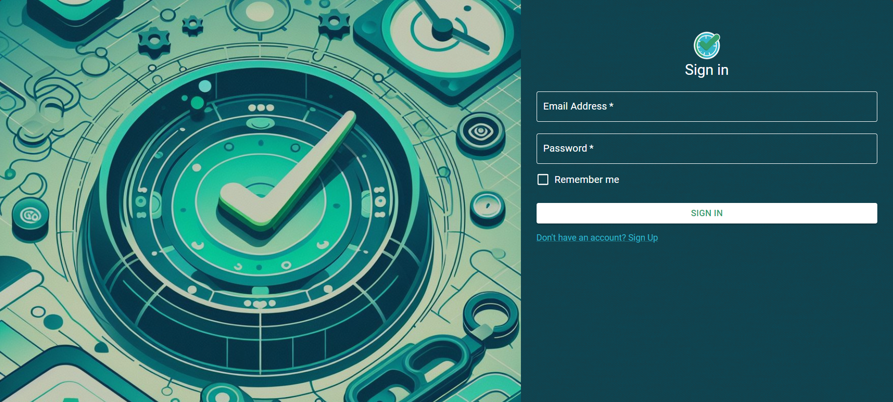
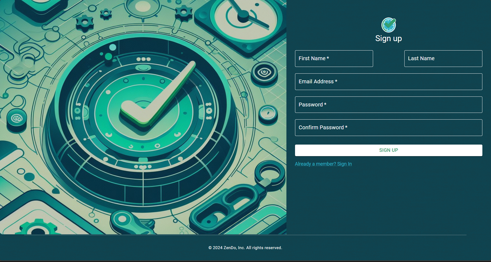
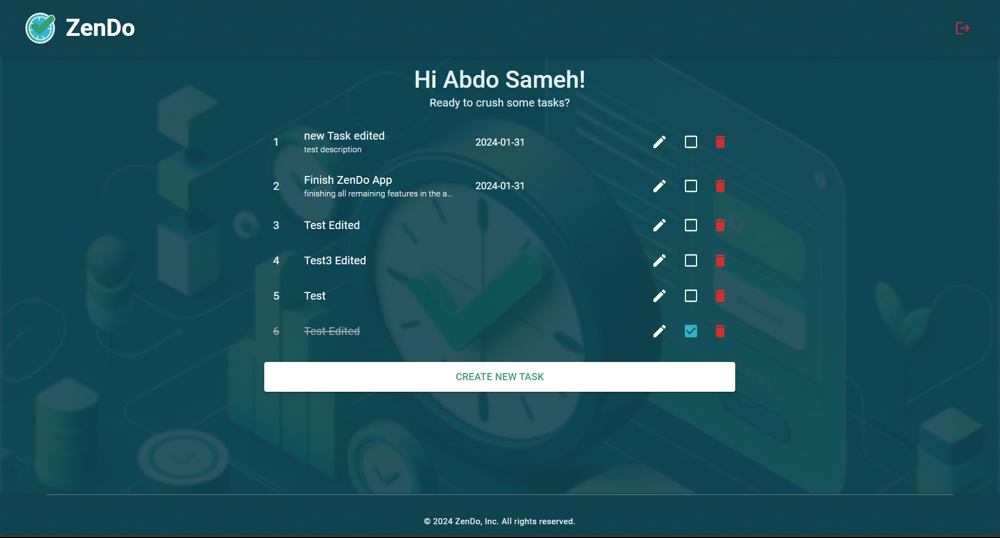
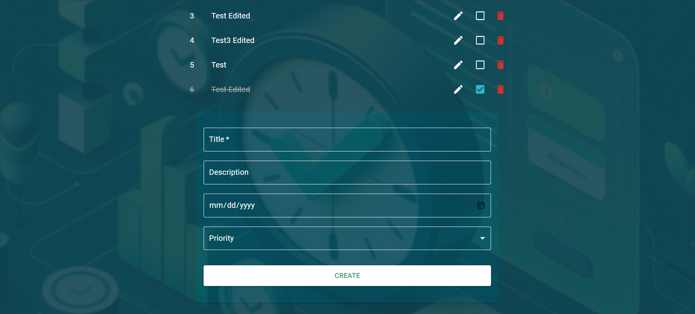
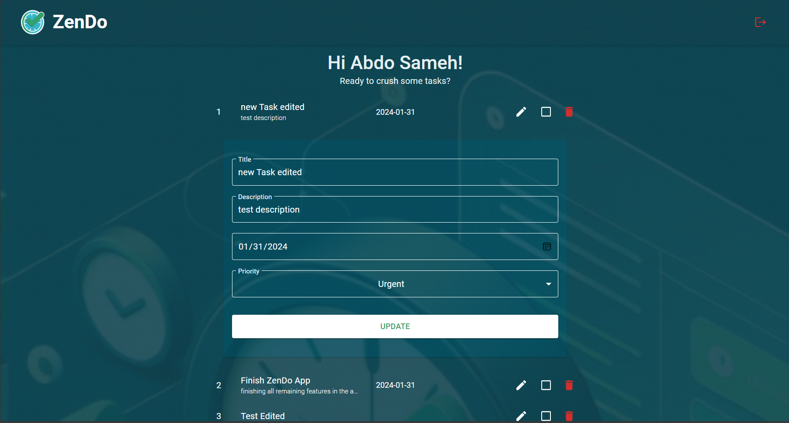

# ZenDo

ZenDo: Your PERN-powered productivity playground. Tame your to-do list with our beautifully crafted web app built with React, Express, Node.js, and PostgreSQL. Say goodbye to overwhelm and hello to effortless organization, gamified achievements, and the joy of ticking off those tasks! Ready to conquer your goals? Try ZenDo today and experience the power of productive simplicity.

## Features

User Registration and Login: Create a secure account to manage your personal tasks.
Task Management:
Create new tasks with detailed descriptions and priorities.
View, edit, and delete existing tasks to keep your list up-to-date.
Responsive Design: Adapts flawlessly to different screen sizes for optimal viewing on any device.
Local Storage: Saves user data for a convenient and persistent experience.
Cookie-Based Authentication: Securely maintains user sessions for a seamless workflow.

## Technology Stack

Frontend: React, Axios
Backend: Node.js
Database: PostgreSQL

## Installation and Usage

1. Clone the repository:

```bash
git clone https://github.com/abdoSamehDev/ZenDo.git
```

2. Server-Side Setup:

- Install Node.js: Download and install Node.js from https://nodejs.org/en.
- Install Dependencies: Open a terminal in the project directory and run npm install. This installs all necessary backend dependencies.

```bash
npm install
```

- Start the Server: Run npm start in the terminal. This starts the server on 4000 port.

```bash
npm start
```

3. Client-Side Setup:

- Install Dependencies: Open a terminal in the project directory and run npm install. This installs all necessary frontend dependencies.

```bash
npm install
```

- Start the Development Server: Run npm start in the terminal. This opens the app in your default web browser, typically at http://localhost:3000.

```bash
npm start
```

3. Database: This project requires a user-created PostgreSQL database for data storage. Please refer to the PostgreSQL documentation for instructions on setting up a database.

## Screenshots

**Screenshot of ZenDo welcome page:** []

**Screenshot of ZenDo login:** []

**Screenshot of ZenDo register:** []

**Screenshot of ZenDo home:** []

**Screenshot of ZenDo create task:** []

**Screenshot of ZenDo update task:** []

## Contact

Feel free to reach out with any questions or feedback!
